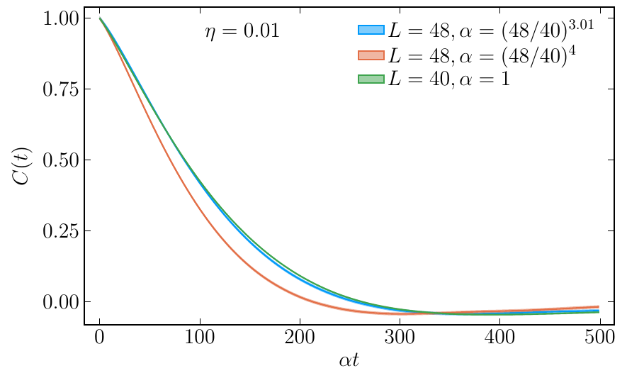
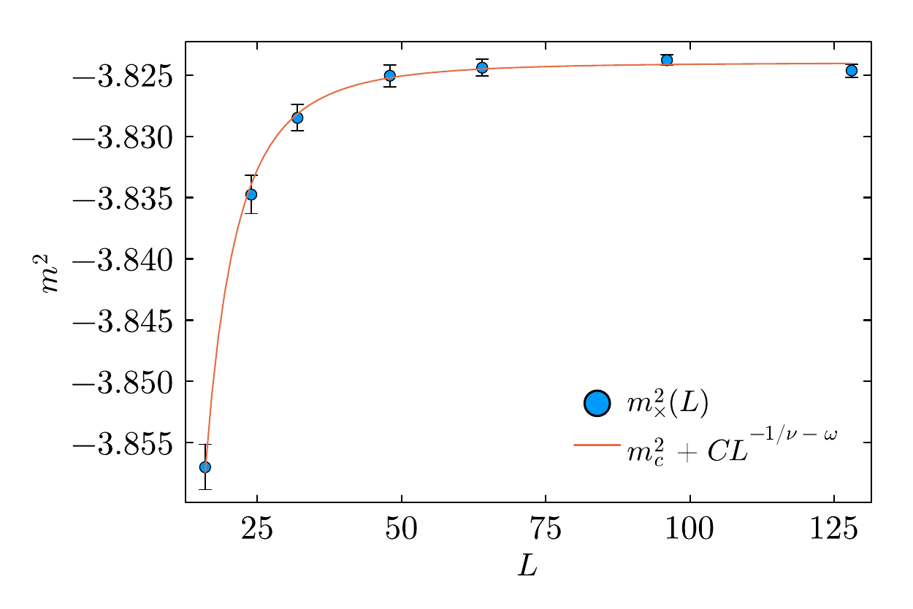
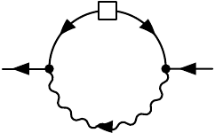
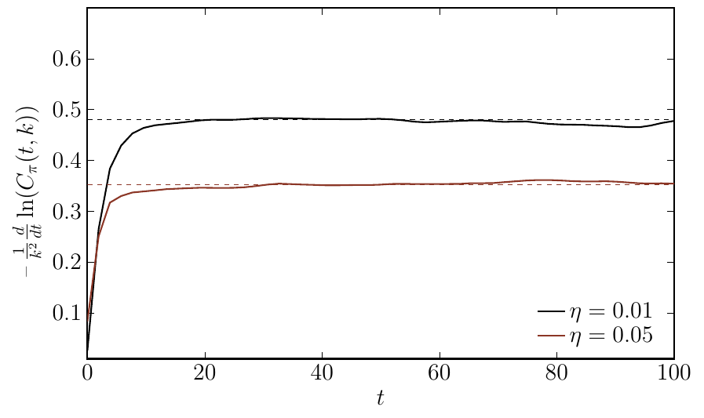
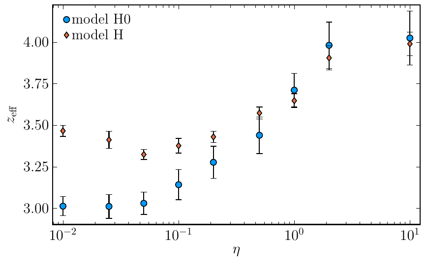

# Critical dynamics: model H <!-- .element: class="r-fit-text" -->

### Vladi Skokov

### North Carolina state University

- C. Chattopadhyay, J. Ott, T. Schaefer, V. S., 2403.10608 and 2411.15994

---

### Outline

- Introduction

  -
  -
  -

- Conclusions

---

### Fluctuations

---

### Hohenberg and Halperin classification

Stochastic theories near critical point:

- Model A: purely relaxational theories

- Model B: critical diffusion

- ...

-  _Model G_ : critical anti-ferromagnets

-  _Model H_ : critical diffusion coupled to Navier-Stokes

---

### Dynamical critical exponent

TODO: definition

- $\epsilon=4-d$ expansion; $\epsilon$ is not small for physically interesting case of $d=3$

- FRG: LPA and LPA' approximations currently

- Our choice: direct simulation of stochastic hydrodynamics

---

### Model H: definition

- Long-time hydrodynamic description of conserved $\phi$ interacting with the conserve momentum density $\vec{\pi}$

$$
\partial_t\phi =   \Gamma \nabla^2 \left(\frac{\delta{\cal H}}{\delta \phi}\right) - \left(\nabla_i\phi\right) \frac{\delta{\cal H}}{\delta \pi_i^T} \zeta
$$

$$
\partial_t \pi^T_i = \eta \nabla^2 \left(\frac{\delta{\cal H}}{\delta \pi^T_i}\right) + P^T_{ij} \left[\left(\nabla_j\phi\right) \frac{\delta{\cal H}} {\delta\phi} \right] - P^T\_{ij} \left[ \nabla_k\left( \pi^{T}_j \frac{\delta{\cal H}}{\delta \pi^T_k}\right) \right] + \xi_i .
$$

- $\Gamma$ and $\eta$ are thermal conductivity and shear viscosity

- The effective Hamiltonian defines statics of the model

$$
{\cal H}  = \int d^dx \left[ \frac{1}{2\rho} ( \pi_i^T)^2 +  \frac{1}{2} (\nabla \phi)^2 +  \frac{1}{2} m^2 \phi^2 +  \frac{1}{4} \lambda  \phi^4  + h \phi\right]
$$

- $\zeta$ and $\xi_i$ are random fields constrained by fluctuation-dissipation relations

$$
\langle \zeta (t, \vec{x}) \zeta (t', \vec{x}') \rangle = -2 T \Gamma \nabla^2 \delta(\vec{x}-\vec{x}')\delta(t-t')
$$

$$
\langle \xi_i (t, \vec{x}) \xi_j (t', \vec{x}') \rangle = -2 T \eta P^T_{ij} \nabla^2 \delta(\vec{x}-\vec{x}')\delta(t-t')
$$

---

###

$$
\partial_t\phi + \vec\nabla\cdot\vec\jmath = 0,  \hspace{1.5cm} \partial_t\pi_{T,i} + P^T_{ij}\nabla_k \Pi_{jk} = 0  .
$$

Here the currents contain non-dissipative as well as a dissipative/stochastic parts

$$
\jmath_i = \jmath_i^{(0)} + \jmath_i^{(1)} \hspace{1cm} \Pi_{ij} = \Pi_{ij}^{(0)} + \Pi_{ij}^{(1)} .
$$

The currents are given by

$$
\jmath_i^{(0)} = \phi \frac{\delta {\cal H}}{\delta \pi^T_i} = \frac{1}{\rho},\phi \pi^T_{i} ,
$$

$$
\jmath_i^{(1)} = -\Gamma \nabla_i \frac{\delta{\cal H}}{\delta \phi} + \Theta_i
$$

as well as

$$
\Pi_{ij}^{(0)} = \frac{1}{\rho}  \pi^T_{i}\pi^T_{j} + (\nabla_i\phi)(\nabla_j\phi )
$$

$$
\Pi_{ij}^{(1)} = -\eta \left[ \nabla_i \frac{\delta{\cal H}}{\delta\pi^T_{j}} +\nabla_j \frac{\delta{\cal H}}{\delta\pi^T_{i}} \right]
\Lambda_{ij}
$$

where $\Theta_i$ and $\Lambda_{ij}$ are delta correlated noise fields with variance $\langle\Theta_i\Theta_j\rangle \sim 2\Gamma T\delta_{ij}$ and $\langle\Lambda_{ij}\Lambda_{kl}\rangle \sim 2\eta T (\delta_{ik}\delta_{jl}+\delta_{il}\delta_{jk})$, respectively. This form of the equation makes the physical meaning of the mode coupling between $\partial_t\vec\pi$ and $\nabla_i\phi$ more transparent. It corresponds to including the stress of $\phi$ in the stress tensor $\Pi_{ij}$.

---

### Lattice Discretization of Field Theory

In order to study the theory numerically we discretize the fields $\phi(\vec{x})$ and $\vec\pi(\vec{x})$ on a $d$-dimensional lattice $\vec{x}=\vec{n}a$ with $n_i=1,\ldots,N$. We can define forward and backward derivatives in the direction $\mu=1,2,3$ as

$$
\nabla^R_\mu\phi(\vec{x}) = \frac{1}{a} [\phi(\vec{x}+\hat{\mu}a)-\phi(\vec{x}) ],
\hspace{0.5cm} \nabla^L_\mu \phi(\vec{x}) = \frac{1}{a} [\phi(\vec{x})-\phi(\vec{x}-\hat{\mu}a) ].
$$

Note that in the actual implementation we set $a = 1$. The Laplacian is defined as $\nabla^2=\nabla^L_\mu\nabla^R_\mu = \nabla^R_\mu\nabla^L_\mu$ where summation over $\mu$ is implied. Note that this lattice derivative satisfies integration by parts

$$
\sum_{\vec{x}} \nabla^R_\mu\phi(\vec{x}) \nabla^R_\mu\phi(\vec{x}) = -\sum_{\vec{x}} \phi(\vec{x}) \nabla^2\phi(\vec{x}),
$$

where we have assumed that the fields satisfy periodic boundary conditions.

Also note that the operators $\nabla_\mu^{R,L}$ are not anti-hermitian,

$$
\left(\nabla^R_\mu\right)^\dagger=-\nabla^L_\mu\, , \hspace{0.7cm} \left(\nabla^L_\mu\right)^\dagger=-\nabla^R_\mu\, ,
$$

but their average, the symmetric (centered) difference operator is

$$
\nabla_\mu^c=\frac{1}{2}\left(\nabla^L_\mu+\nabla^R_\mu\right) \, , \hspace{0.7cm} (\nabla_\mu^c)^\dagger = -\nabla_\mu^c \, .
$$

We can define a centered Laplacian

$$
\left(\nabla_\nu^c\right)^2\phi(\vec{x}) = \frac{1}{4} \sum_\nu\, \Big\{ \phi(\vec{x} + 2 \hat{\nu}) \phi(\vec{x} - 2 \hat{\nu}) - 2 \phi(\vec{x}) \Big\},
$$

We are now in a position to specify the lattice discretized Hamiltonian as

$$
{\cal H}  = \sum_{\vec{x}} \left[ \frac{1}{2\rho} \pi^T_\mu(\vec{x})\pi^T_\mu(\vec{x}) + \frac{1}{2} \nabla^R_\mu\phi(\vec{x}) \nabla^R_\mu \phi(\vec{x}) \frac{1}{2} m^2 \phi^2(\vec{x}) \frac{1}{4} \lambda  \phi^4(\vec{x}) \right] \, ,
$$

where again the sum over $\mu$ is implied. Below, we will also consider a Hamiltonian where the gradient term is defined in terms of centered derivatives

# Conservation Laws in Numerical Field Theory

---

## Motivation

- When solving equations of motion numerically, we want to maintain conservation laws and symmetries
- In continuum theory, the equations can be written in forms that manifestly conserve momentum and charge
- The symplectic structure of the advection term implies conservation of the Hamiltonian $\mathcal{H}$

---

## Continuum Advection Terms

The advection term for $(\phi, \vec{\pi}^T)$ in the continuum:

$$
\dot{\phi} = - \nabla_i \left( \phi \, \frac{\pi^T_i}{\rho} \right) = - \frac{\pi^T_i}{\rho} \, \nabla_i \phi
$$

$$
\dot{\pi}^T_{i} = - P^T_{ij} \left[ \nabla_k \left( \frac{1}{\rho} \, \pi^T_{k} \pi^T_{j} \right) + \nabla_j \phi \nabla^2 \phi \right]
$$

---

## Energy Conservation in Continuum

Time derivative of the Hamiltonian:

$$
\dot{{\cal H}} = \int d^3x \, \left[ - \dot{\phi} \, \nabla^2 \phi + \frac{1}{\rho} \, \pi^T_{i} \dot{\pi}^T_{i} + V'(\phi) \, \dot{\phi} \right]
$$

After substitution:

$$
\dot{{\cal H}} = \int d^3x \, \left[ (\nabla^2\phi) \, \frac{\pi^T_i}{\rho} \nabla_i \phi - \frac{\pi^T_i}{\rho} \left( \frac{\pi^T_j}{\rho} \nabla_j \right) \pi^T_i - (\nabla^2\phi) \, \frac{\pi^T_i}{\rho} \nabla_i \phi - \nabla_i \left( V(\phi) \frac{\pi^T_i}{\rho} \right) \right]
$$

- First and third terms cancel
- Second term becomes a divergence
- Energy is conserved (boundary terms ignored)

---

## Challenges in Discrete Theory

- Vector identities from continuum may not hold in discretized theory
- Integration by parts identities may fail
- Need special formulations to maintain conservation laws

---

## Skew-Symmetric Form

From Morinishi et al., the "skew-symmetric" form:

$$
\left.\nabla_\mu \left(\frac{1}{\rho} \pi^T_{\mu} \pi^T_{\nu} \right) \right|_{\it skew} \equiv \frac{1}{2} \, \nabla_\mu \left( \frac{1}{\rho} \pi^T_{\mu} \pi^T_{\nu} \right) + \frac{1}{2} \, \frac{\pi^T_{\mu}}{\rho} \, \nabla_\mu \pi^T_{\nu}
$$

- Conserves kinetic energy independent of continuity relation $\nabla_k\pi^T_k=0$

---

## Lattice Interpolation

Special definitions for the lattice:

$$
\overline{\phi}^{\,\hat\mu} \equiv \frac{1}{2}\big[\phi\left(\vec{x} + \hat\mu/2 \right) + \psi\left(\vec{x} - \hat\mu/2 \right) \big]
$$

$$
(\widetilde{\phi \, \psi})^{\hat\mu} \equiv \frac{1}{2}\big[\phi\left(\vec{x} + \hat\mu/2 \right) \psi\left(\vec{x} - \hat\mu/2 \right) + \phi\left(\vec{x} - \hat\mu/2 \right) \psi\left(\vec{x} + \hat\mu/2 \right)\big]
$$

$$
\nabla^{1/2}_\mu \phi(x) = \frac{1}{2} \big[\phi(x+\hat{\mu}/2) - \phi(x - \hat{\mu}/2) \big]
$$

---

## Product Rule on Lattice

With these definitions, we recover the product rule:

$$
\nabla^{1/2}_\mu \left( \widetilde{\phi \, \psi} \right)^{\hat{\mu}} = \left(\nabla^c_{\mu} \phi\right)\psi + \phi \, \left(\nabla^c_\mu \psi\right)
$$

This allows us to show:

$$
\frac{1}{2}\, \frac{d}{dt}\, \left(\pi^T_{\nu}\pi^T_\nu\right) = \frac{1}{2}\, \nabla_\mu^{1/2} \Big[(\overline{\pi^T_{\mu}})^{\hat{\mu}} (\widetilde{\pi^T_{\nu}\pi^T_{\nu}})^{\hat{\mu}}\Big]
$$

- Ensures the advection step conserves kinetic energy

---

## Mutual Advection of φ and π

For mutual advection with centered derivatives:

$$
\dot\phi = - \frac{1}{\rho}\,\pi^T_{\mu} \nabla^c_{\mu} \phi\,
$$

$$
\dot\pi^T_\mu = - \left(\nabla_\mu^c\phi\right) \left(\nabla_\nu^c\nabla_\nu^c\phi\right)
$$

- This update conserves the Hamiltonian:

$$
{\cal H}_\pi+{\cal H}^c_{\partial\phi} = \sum_{\vec{x}} \left[ \frac{1}{2\rho} \pi^T_\mu(\vec{x})\pi^T_\mu(\vec{x}) + \frac{1}{2} \nabla^c_\mu\phi(\vec{x}) \nabla^c_\mu \phi(\vec{x}) \right]
$$

- Does not exactly conserve potential energy

---

## Final Discretization

Summary of spatial discretization for the advection step:

$$
\dot{\phi} = - \frac{1}{\rho}\, \pi^T_{\mu} \, \nabla^c_{\mu} \phi
$$

$$
\dot{\pi}^T_{\mu} = - \left[ \frac{1}{2} \nabla^c_{\nu} \left( \frac{1}{\rho} \pi^T_\nu \pi^T_\mu \right) + \frac{1}{2\rho} \pi^T_\nu \, \nabla^c_{\nu} \pi^T_\mu + \left(\nabla^c_\mu \phi\right) \left(\nabla^c_\nu\nabla^c_\nu\phi\right) \right]
$$

- After each discrete time step, apply transverse projection
- Ensures transversality with regard to centered derivative: $\nabla_\mu^c\pi^T_\mu(\vec{x})=0$
- Energy is conserved up to finite lattice spacing corrections

# Numerical Methods for Field Evolution

---

## Third-order Runge-Kutta Method (RK3)

### For Advection Terms

- We define a four-component field $\phi_\mu = (\phi, \vec{\pi}^T)$
- Evolution equation: $\dot{\phi}_\mu = \mathcal{F}_\mu (\phi_\nu)$

---

## RK3 Integration Scheme (Shu & Osher)

1. First step:
   $\phi^{n+1/3}_\mu = \phi^n_\mu + \Delta t \, \mathcal{F}_\mu (\phi^n_\nu)$

2. Second step:
   $\phi^{n+2/3}_\mu = \frac{3}{4} \, \phi^n_\mu + \frac{1}{4} \, \phi^{n+1/3}_\mu + \frac{\Delta t}{4} \, \mathcal{F}_\mu(\phi^{n+1/3}_\nu)$

3. Third step:
   $\phi^{n+1}_\mu = \frac{1}{3} \, \phi^{n}_\mu + \frac{2}{3} \, \phi^{n+2/3}_\mu + \frac{2}{3} \, \Delta t \, \mathcal{F}_\mu(\phi^{n+2/3}_\nu)$

- Transverse projector applied after each substep

---

## Dissipative Update: Metropolis Algorithm

**Key Insight**:

- Diffusive step and noise term implemented via a single Metropolis update
- First moment → diffusive step
- Second moment → noise term
- Guarantees fluctuation-dissipation relations
- Converges to equilibrium distribution: $P[\phi_\mu]\sim \exp(-\mathcal{H}[\phi_\mu]/T)$

---

## Metropolis Update for Scalar Field $\phi$

Trial update:

- $\phi^{\text{trial}}(\vec{x},t+\Delta t) = \phi(\vec{x},t) + q_\mu$
- $\phi^{\text{trial}}(\vec{x}+\hat\mu,t+\Delta t) = \phi(\vec{x}+\hat{\mu},t) - q_\mu$
- $q_\mu = \sqrt{2\Gamma T(\Delta t)}\, \xi$

Where:

- $\xi$ is a Gaussian random variable with unit variance
- $\hat{\mu}$ is an elementary lattice vector

Accept with probability $\min(1,e^{-\Delta\mathcal{H}/T})$

---

## Metropolis Update for Momentum Density $\vec{\pi}$

Trial update:

- $\pi_\nu^{\text{trial}}(\vec{x},t+\Delta t) = \pi_\nu(\vec{x},t) + r_{\nu}^{(\mu)}$
- $\pi_\nu^{\text{trial}}(\vec{x}+\hat\mu,t+\Delta t) = \pi_\nu(\vec{x}+\hat{\mu},t) - r_{\nu}^{(\mu)}$
- $r_{\nu}^{(\mu)} = \sqrt{2\eta T (\Delta t)}\, \zeta_{\nu}^{(\mu)}$

Where:

- $\zeta_\nu^{(\mu)}$ are Gaussian random variables with $\langle \zeta_\mu^{(\alpha)}\zeta_\nu^{(\beta)}\rangle = \delta_{\mu\nu}\delta^{\alpha\beta}$

Accept with probability $\min(1,e^{-\Delta\mathcal{H}/T})$

---

## Transverse Projection

- After a complete sweep, project onto transverse component:
  $\pi_\mu^T (\vec{x},t) = P^T_{\mu\nu} \pi_\nu(\vec{x})$
- Projection carried out in Fourier space
- Ensures $(d-1)$ fluctuating degrees of freedom for momentum density
- Average energy per mode equals $\frac{d-1}{2}T$ rather than $\frac{d}{2}T$

---

## Calculating Energy Changes for Metropolis Steps

For scalar field change at point $\vec{x}$:

$\Delta \mathcal{H}_\phi(\vec{x}) = d[({\phi^{\text{trial}}(\vec{x})})^2 - ({\phi(\vec{x})})^2] - (\phi^{\text{trial}}(\vec{x}) - \phi(\vec{x}))\sum_{\mu=1}^d [\phi(\vec{x}+\hat{\mu}) + \phi(\vec{x}-\hat{\mu})] + \frac{1}{2}m^2[({\phi^{\text{trial}}(\vec{x})})^2 - ({\phi(\vec{x})})^2] + \frac{1}{4}\lambda[({\phi^{\text{trial}}(\vec{x})})^4 - ({\phi(\vec{x})})^4]$

---

## Energy Changes (continued)

For conserving update (transferring charge $q_\mu$ from $\vec{x}+\hat{\mu}$ to $\vec{x}$):

$\Delta \mathcal{H}_\phi (\vec{x}, \vec{x}+\hat \mu) = \Delta \mathcal{H}_\phi(\vec{x}) + \Delta \mathcal{H}_\phi (\vec{x}+\hat \mu) + (q_\mu)^2$

For momentum transfer:

$\Delta \mathcal{H}_\pi (\vec{x}, \vec{x}+\hat \mu) = \frac{1}{\rho}[r_{\nu}^{(\mu)}(\pi^T_\nu(\vec{x})-\pi^T_\nu(\vec{x}+\hat{\mu})) + (r_{\nu}^{(\mu)})^2]$

---

## Implementation Notes

- Metropolis updates performed on a checkerboard pattern
- Timestep for dissipative update can differ from Runge-Kutta timestep
- Transverse projection operator applied after complete lattice sweep

# Theoretical Expectations for Model H

---

## Static Behavior

- Governed by partition function: $Z = \int D\phi\, D\vec\pi^T\, \exp\left(-\frac{\mathcal{H}}{T}\right)$
- No coupling between scalar field $\phi$ and momentum density $\vec\pi^T$ in Hamiltonian
- Momentum density correlation:
  $\langle \pi^T_i(0,\vec{x})\pi^T_j(0,\vec{x}^{\,\prime})\rangle = T\rho\, P^T_{ij}\delta^3(\vec{x}-\vec{x}^{\,\prime})$
- Spectral density independent of $\vec{k}$ (classical equidistribution)

---

## Critical Behavior of Scalar Field

- Scalar field $\phi$ in Ising model universality class
- At critical point ($m^2 = m_c^2$), two-point function:
  $\langle \phi(0,\vec{x})\phi(0,\vec{x}^{\,\prime})\rangle \sim |\vec{x}-\vec{x}^{\,\prime}|^{-d+2-\eta^*}$

  where $\eta^* \simeq 0.0363$ in 3D

- Away from critical point, correlation length:
  $\xi \sim |m^2-m_c^2|^{-\nu}$ with $\nu \simeq 0.62999(5)$ in 3D

---

## Susceptibility

- Defined as integral of two-point function:
  $\chi = \int d^dx\, \langle \phi(0,\vec{0})\phi(0,\vec{x})\rangle$
- Critical scaling: $\chi \sim |m^2-m_c^2|^{-\gamma}$ with $\gamma=\nu(2-\eta)$

- Small value of $\eta^*$ means susceptibility close to mean field prediction $\chi\sim\xi^2$

- Two-point function in momentum space approximately follows Ornstein-Zernike form:
  $\langle \phi(0,\vec{k})\phi(0,-\vec{k})\rangle \sim \xi^2/(1+(k\xi)^2)$

---

## Dynamics: Momentum Density

- Transverse momentum correlation function:
  $C_{ij}(t,\vec{k}) = \langle \pi_i^T(0,\vec{k})\pi_j^T(t,-\vec{k})\rangle$
- Transversality implies $C_{ij}(t,\vec{k})= (\delta_{ij}-\hat{k}_i\hat{k}_j) C_\pi(t,k)$

- In linearized hydrodynamics (shear mode):
  $C_\pi(t,k) = \rho T\, \exp\left(-(\eta/\rho)k^2t\right)$

---

## Renormalization of Viscosity

- Self-advection of momentum density (shear modes) renormalizes viscosity:
  $\eta_R = \eta + \frac{7}{60\pi^2} \frac{\rho T\Lambda}{\eta}$

  where $\Lambda \simeq \pi/a$ is momentum-space cutoff

- Minimum renormalized viscosity:
  $\left.\eta_R\right|_{\text{min}} = \sqrt{\frac{7}{15\pi}}\, \sqrt{\frac{\rho T}{a}}$
- In units where $T=a=1$: $\eta_R|_{\text{min}} \simeq 0.39\sqrt{\rho}$

---

## Additional Renormalization Effects

- Coupling to scalar field also renormalizes viscosity:
  $\eta_{R} = \eta + \frac{1}{160\pi} \frac{T\xi^0}{\Gamma}$

  (much smaller correction than self-advection for typical parameters)

- Long-time behavior modified by non-linear effects:
  - Long time tail scales as $t^{-3/2}\exp(-D_\eta k^2t/2)$
  - In non-perturbative regime: $C_\pi \sim \exp(-\sqrt{\alpha D_\eta k^2 t})$

---

## Order Parameter Dynamics

- Order parameter correlation function:
  $C_\phi(t,\vec{k}) = \langle \phi(0,\vec{k})\phi(t,-\vec{k})\rangle$
- Wave-number dependent relaxation rate:
  $\Gamma_k = \frac{\Gamma}{\xi^4}(k\xi)^2(1+(k\xi)^2) + \frac{T}{6\pi\eta_R\xi^3}\, K(k\xi)$

  where $K(x)$ is the Kawasaki function

---

## Kawasaki Function

- $K(x) = \frac{3}{4}[1+x^2+(x^3-x^{-1})\tan^{-1}(x)]$
- Asymptotic behavior:

  - $K(x) \simeq x^2$ for $x \ll 1$
  - $K(x) \simeq (3\pi/8)x^3$ for $x \gg 1$

- First term in $\Gamma_k$: mean field relaxation rate (model B)
- Second term: coupling to fluid momentum density

---

## Dynamical Critical Exponent

- Model B: $z = 4$ (mean field), $z = 4-\eta$ (with fluctuations)
- Model H (with momentum coupling): $z \simeq 3$

  - $\epsilon$-expansion at two loops: $z \simeq 3.0712$
  - Kawasaki approximation: wave number dependence $\Gamma_k \sim k^2$ (small $k\xi$), $\Gamma_k \sim k^3$ (large $k\xi$)

---

## Critical Viscosity

- Viscosity diverges at critical point:
  $\eta_R = \eta[1 + \frac{8}{15\pi^2}\log(\xi/\xi_0)]$
- Scaling: $\eta_R \sim \xi^{x_\eta}$ with $x_\eta = \frac{8}{15\pi^2} \simeq 0.054$
- $\epsilon$-expansion (two loops): $x_\eta \simeq 0.071$
- Divergence is weak, Kawasaki approximation remains approximately self-consistent

---

## Physical Argument for z ≈ 3

1. Define renormalized conductivity $\Gamma_R$ by $\Gamma_k = \Gamma_R\chi^{-1}k^2$ (for $k\xi < 1$)
2. Critical scaling: $\Gamma_R \sim \xi^{x_\Gamma}$ (Kawasaki: $x_\Gamma = 1$)
3. Balance of diffusion and convection in external field gives:
   $x_\Gamma + x_\eta = 4-d-\eta^*$
4. For small $x_\eta$ and $\eta^*$ in 3D: $x_\Gamma \simeq 1$
5. Matching relaxation rates: $z = 4-x_\Gamma-\eta$
6. Result: $z = d+x_\eta \simeq d = 3$ for small $x_\eta$

---

---

---

---

---

---

---

---

---

---

---

---

---

---

---

---

---

---

###

---

### Conclusions

-
- -
  -
- ***

      - $$
