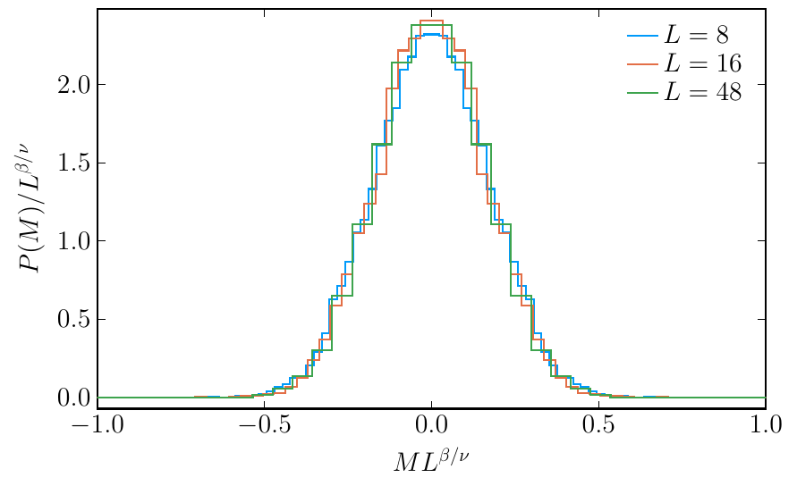
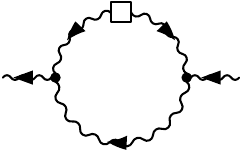

# Critical dynamics: model H <!-- .element: class="r-fit-text" -->

### Vladi Skokov

### North Carolina state University

- C. Chattopadhyay, J. Ott, T. Schaefer, V. S., 2403.10608 and 2411.15994

---

### Outline

- Introduction

  -
  -
  -

- Conclusions

---

###

$$
\partial_t\phi =   \Gamma \nabla^2 \left(\frac{\delta{\cal H}}{\delta \phi}\right) - \left(\nabla_i\phi\right) \frac{\delta{\cal H}}{\delta \pi_i^T} \zeta
$$

$$
\partial_t \pi^T_i = \eta \nabla^2 \left(\frac{\delta{\cal H}}{\delta \pi^T_i}\right) + P^T_{ij} \left[\left(\nabla_j\phi\right) \frac{\delta{\cal H}} {\delta\phi} \right] - P^T\_{ij} \left[ \nabla_k\left( \pi^{T}_j \frac{\delta{\cal H}}{\delta \pi^T_k}\right) \right] + \xi_i .
$$

$$
{\cal H}  = \int d^dx \left[ \frac{1}{2\rho} ( \pi_i^T)^2 +  \frac{1}{2} (\nabla \phi)^2 +  \frac{1}{2} m^2 \phi^2 +  \frac{1}{4} \lambda  \phi^4  + h \phi\right]
$$

$$
\langle \zeta (t, \vec{x}) \zeta (t', \vec{x}') \rangle = -2 T \Gamma \nabla^2 \delta(\vec{x}-\vec{x}')\delta(t-t')
$$

$$
\langle \xi_i (t, \vec{x}) \xi_j (t', \vec{x}') \rangle = -2 T \eta P^T_{ij} \nabla^2 \delta(\vec{x}-\vec{x}')\delta(t-t')
$$

---

###

$$
\partial_t\phi + \vec\nabla\cdot\vec\jmath = 0,  \hspace{1.5cm} \partial_t\pi_{T,i} + P^T_{ij}\nabla_k \Pi_{jk} = 0  .
$$

Here the currents contain non-dissipative as well as a dissipative/stochastic parts

$$
\jmath_i = \jmath_i^{(0)} + \jmath_i^{(1)} \hspace{1cm} \Pi_{ij} = \Pi_{ij}^{(0)} + \Pi_{ij}^{(1)} .
$$

The currents are given by

$$
\jmath_i^{(0)} = \phi \frac{\delta {\cal H}}{\delta \pi^T_i} = \frac{1}{\rho},\phi \pi^T_{i} ,
$$

$$
\jmath_i^{(1)} = -\Gamma \nabla_i \frac{\delta{\cal H}}{\delta \phi} + \Theta_i
$$

as well as

$$
\Pi_{ij}^{(0)} = \frac{1}{\rho}  \pi^T_{i}\pi^T_{j} + (\nabla_i\phi)(\nabla_j\phi )
$$

$$
\Pi_{ij}^{(1)} = -\eta \left[ \nabla_i \frac{\delta{\cal H}}{\delta\pi^T_{j}} +\nabla_j \frac{\delta{\cal H}}{\delta\pi^T_{i}} \right]
\Lambda_{ij}
$$

where $\Theta_i$ and $\Lambda_{ij}$ are delta correlated noise fields with variance $\langle\Theta_i\Theta_j\rangle \sim 2\Gamma T\delta_{ij}$ and $\langle\Lambda_{ij}\Lambda_{kl}\rangle \sim 2\eta T (\delta_{ik}\delta_{jl}+\delta_{il}\delta_{jk})$, respectively. This form of the equation makes the physical meaning of the mode coupling between $\partial_t\vec\pi$ and $\nabla_i\phi$ more transparent. It corresponds to including the stress of $\phi$ in the stress tensor $\Pi_{ij}$.

---

### Lattice Discretization of Field Theory

In order to study the theory numerically we discretize the fields $\phi(\vec{x})$ and $\vec\pi(\vec{x})$ on a $d$-dimensional lattice $\vec{x}=\vec{n}a$ with $n_i=1,\ldots,N$. We can define forward and backward derivatives in the direction $\mu=1,2,3$ as

$$
\nabla^R_\mu\phi(\vec{x}) = \frac{1}{a} [\phi(\vec{x}+\hat{\mu}a)-\phi(\vec{x}) ],
\hspace{0.5cm} \nabla^L_\mu \phi(\vec{x}) = \frac{1}{a} [\phi(\vec{x})-\phi(\vec{x}-\hat{\mu}a) ].
$$

Note that in the actual implementation we set $a = 1$. The Laplacian is defined as $\nabla^2=\nabla^L_\mu\nabla^R_\mu = \nabla^R_\mu\nabla^L_\mu$ where summation over $\mu$ is implied. Note that this lattice derivative satisfies integration by parts

$$
\sum_{\vec{x}} \nabla^R_\mu\phi(\vec{x}) \nabla^R_\mu\phi(\vec{x}) = -\sum_{\vec{x}} \phi(\vec{x}) \nabla^2\phi(\vec{x}),
$$

where we have assumed that the fields satisfy periodic boundary conditions.

Also note that the operators $\nabla_\mu^{R,L}$ are not anti-hermitian,

$$
\left(\nabla^R_\mu\right)^\dagger=-\nabla^L_\mu\, , \hspace{0.7cm} \left(\nabla^L_\mu\right)^\dagger=-\nabla^R_\mu\, ,
$$

but their average, the symmetric (centered) difference operator is

$$
\nabla_\mu^c=\frac{1}{2}\left(\nabla^L_\mu+\nabla^R_\mu\right) \, , \hspace{0.7cm} (\nabla_\mu^c)^\dagger = -\nabla_\mu^c \, .
$$

We can define a centered Laplacian

$$
\left(\nabla_\nu^c\right)^2\phi(\vec{x}) = \frac{1}{4} \sum_\nu\, \Big\{ \phi(\vec{x} + 2 \hat{\nu}) \phi(\vec{x} - 2 \hat{\nu}) - 2 \phi(\vec{x}) \Big\},
$$

We are now in a position to specify the lattice discretized Hamiltonian as

$$
{\cal H}  = \sum_{\vec{x}} \left[ \frac{1}{2\rho} \pi^T_\mu(\vec{x})\pi^T_\mu(\vec{x}) + \frac{1}{2} \nabla^R_\mu\phi(\vec{x}) \nabla^R_\mu \phi(\vec{x}) \frac{1}{2} m^2 \phi^2(\vec{x}) \frac{1}{4} \lambda  \phi^4(\vec{x}) \right] \, ,
$$

where again the sum over $\mu$ is implied. Below, we will also consider a Hamiltonian where the gradient term is defined in terms of centered derivatives

# Conservation Laws in Numerical Field Theory

---

## Motivation

- When solving equations of motion numerically, we want to maintain conservation laws and symmetries
- In continuum theory, the equations can be written in forms that manifestly conserve momentum and charge
- The symplectic structure of the advection term implies conservation of the Hamiltonian $\mathcal{H}$

---

## Continuum Advection Terms

The advection term for $(\phi, \vec{\pi}^T)$ in the continuum:

$$
\dot{\phi} = - \nabla_i \left( \phi \, \frac{\pi^T_i}{\rho} \right) = - \frac{\pi^T_i}{\rho} \, \nabla_i \phi
$$

$$
\dot{\pi}^T_{i} = - P^T_{ij} \left[ \nabla_k \left( \frac{1}{\rho} \, \pi^T_{k} \pi^T_{j} \right) + \nabla_j \phi \nabla^2 \phi \right]
$$

---

## Energy Conservation in Continuum

Time derivative of the Hamiltonian:

$$
\dot{{\cal H}} = \int d^3x \, \left[ - \dot{\phi} \, \nabla^2 \phi + \frac{1}{\rho} \, \pi^T_{i} \dot{\pi}^T_{i} + V'(\phi) \, \dot{\phi} \right]
$$

After substitution:

$$
\dot{{\cal H}} = \int d^3x \, \left[ (\nabla^2\phi) \, \frac{\pi^T_i}{\rho} \nabla_i \phi - \frac{\pi^T_i}{\rho} \left( \frac{\pi^T_j}{\rho} \nabla_j \right) \pi^T_i - (\nabla^2\phi) \, \frac{\pi^T_i}{\rho} \nabla_i \phi - \nabla_i \left( V(\phi) \frac{\pi^T_i}{\rho} \right) \right]
$$

- First and third terms cancel
- Second term becomes a divergence
- Energy is conserved (boundary terms ignored)

---

## Challenges in Discrete Theory

- Vector identities from continuum may not hold in discretized theory
- Integration by parts identities may fail
- Need special formulations to maintain conservation laws

---

## Skew-Symmetric Form

From Morinishi et al., the "skew-symmetric" form:

$$
\left.\nabla_\mu \left(\frac{1}{\rho} \pi^T_{\mu} \pi^T_{\nu} \right) \right|_{\it skew} \equiv \frac{1}{2} \, \nabla_\mu \left( \frac{1}{\rho} \pi^T_{\mu} \pi^T_{\nu} \right) + \frac{1}{2} \, \frac{\pi^T_{\mu}}{\rho} \, \nabla_\mu \pi^T_{\nu}
$$

- Conserves kinetic energy independent of continuity relation $\nabla_k\pi^T_k=0$

---

## Lattice Interpolation

Special definitions for the lattice:

$$
\overline{\phi}^{\,\hat\mu} \equiv \frac{1}{2}\big[\phi\left(\vec{x} + \hat\mu/2 \right) + \psi\left(\vec{x} - \hat\mu/2 \right) \big]
$$

$$
(\widetilde{\phi \, \psi})^{\hat\mu} \equiv \frac{1}{2}\big[\phi\left(\vec{x} + \hat\mu/2 \right) \psi\left(\vec{x} - \hat\mu/2 \right) + \phi\left(\vec{x} - \hat\mu/2 \right) \psi\left(\vec{x} + \hat\mu/2 \right)\big]
$$

$$
\nabla^{1/2}_\mu \phi(x) = \frac{1}{2} \big[\phi(x+\hat{\mu}/2) - \phi(x - \hat{\mu}/2) \big]
$$

---

## Product Rule on Lattice

With these definitions, we recover the product rule:

$$
\nabla^{1/2}_\mu \left( \widetilde{\phi \, \psi} \right)^{\hat{\mu}} = \left(\nabla^c_{\mu} \phi\right)\psi + \phi \, \left(\nabla^c_\mu \psi\right)
$$

This allows us to show:

$$
\frac{1}{2}\, \frac{d}{dt}\, \left(\pi^T_{\nu}\pi^T_\nu\right) = \frac{1}{2}\, \nabla_\mu^{1/2} \Big[(\overline{\pi^T_{\mu}})^{\hat{\mu}} (\widetilde{\pi^T_{\nu}\pi^T_{\nu}})^{\hat{\mu}}\Big]
$$

- Ensures the advection step conserves kinetic energy

---

## Mutual Advection of φ and π

For mutual advection with centered derivatives:

$$
\dot\phi = - \frac{1}{\rho}\,\pi^T_{\mu} \nabla^c_{\mu} \phi\,
$$

$$
\dot\pi^T_\mu = - \left(\nabla_\mu^c\phi\right) \left(\nabla_\nu^c\nabla_\nu^c\phi\right)
$$

- This update conserves the Hamiltonian:

$$
{\cal H}_\pi+{\cal H}^c_{\partial\phi} = \sum_{\vec{x}} \left[ \frac{1}{2\rho} \pi^T_\mu(\vec{x})\pi^T_\mu(\vec{x}) + \frac{1}{2} \nabla^c_\mu\phi(\vec{x}) \nabla^c_\mu \phi(\vec{x}) \right]
$$

- Does not exactly conserve potential energy

---

## Final Discretization

Summary of spatial discretization for the advection step:

$$
\dot{\phi} = - \frac{1}{\rho}\, \pi^T_{\mu} \, \nabla^c_{\mu} \phi
$$

$$
\dot{\pi}^T_{\mu} = - \left[ \frac{1}{2} \nabla^c_{\nu} \left( \frac{1}{\rho} \pi^T_\nu \pi^T_\mu \right) + \frac{1}{2\rho} \pi^T_\nu \, \nabla^c_{\nu} \pi^T_\mu + \left(\nabla^c_\mu \phi\right) \left(\nabla^c_\nu\nabla^c_\nu\phi\right) \right]
$$

- After each discrete time step, apply transverse projection
- Ensures transversality with regard to centered derivative: $\nabla_\mu^c\pi^T_\mu(\vec{x})=0$
- Energy is conserved up to finite lattice spacing corrections

---

---

---

---

---

---

---

---

---

---

---

---

---

---

---

---

---

---

###

---

### Conclusions

-
- -
  -
- ***

      - $$
