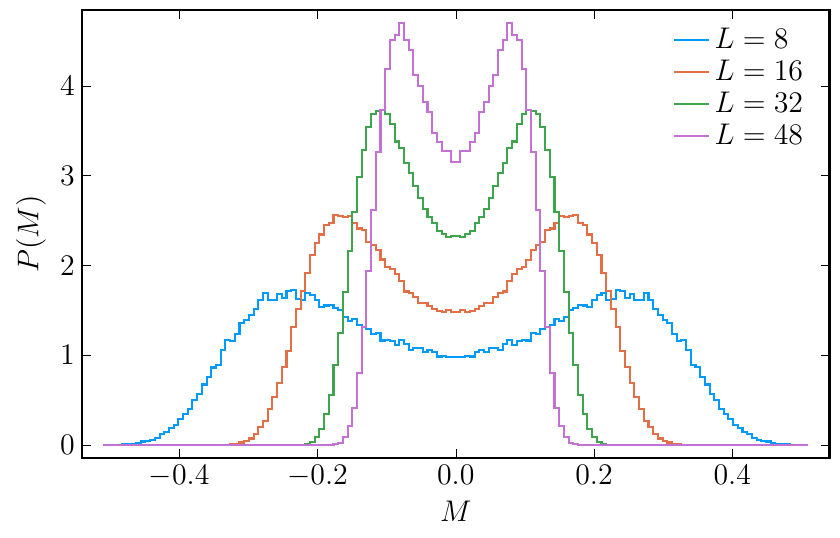
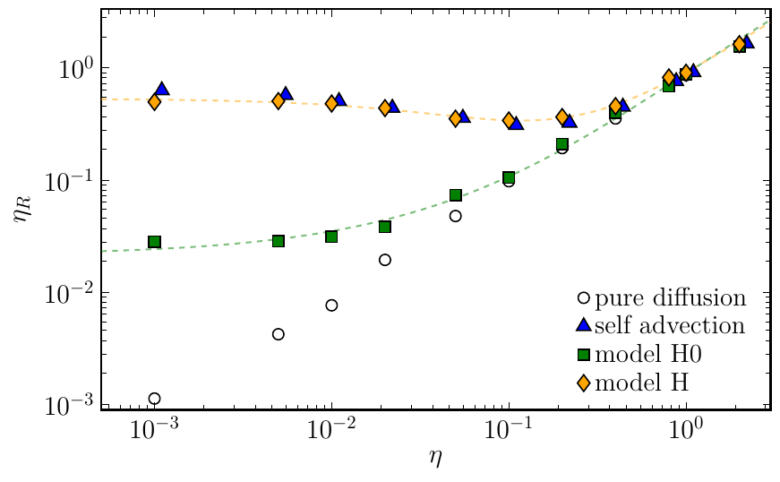

# Critical dynamics: model H <!-- .element: class="r-fit-text" -->

### Vladi Skokov

### North Carolina state University

- Model A: T. Schaefer, V. S., 2204.02433  
- Model B: **C. Chattopadhyay**, **J. Ott**, T. Schaefer, V. S., 2304.07279  
- Model H: **C. Chattopadhyay**, **J. Ott**, T. Schaefer, V. S., 2403.10608 and 2411.15994

---

### Outline

- Introduction

- Model H: definition

- Numerical scheme

- Theory expectations

- Numerical results

- Conclusions

---
### Motivation 

* Transition from hadronic matter to QGP along the temperature axis in the QCD phase diagram is a smooth crossover.

* As baryon doping increases, this crossover may transform into a first-order phase transition at a critical endpoint.

* Experimental searches for critical behavior have focused on non-monotonic dependence of fluctuation observables on beam energy/rapidity window. 

* Understanding the dynamical evolution of these observables in HIC requires a hydrodynamic theory that incorporates fluctuation effects.

* A necessary step: numerical simulation of Navier-Stokes equations near critical point  

---
### Universality classes: statics vs dynamics 

* Near-equilibrium  dynamics is universal 

* Unlike static universality classes, dynamical universality classes are governed by additional factors beyond dimensionality, locality, and symmetries.

* Properties of slow modes are crucial determinants of dynamical universality classes.

* Conservation  of an order parameter affects the dynamical universality class.

* Mode-mode couplings among slow modes influence the dynamical universality class.

* Two systems that belong to the same static universality class may belong to different dynamical universality classes.

---

### Hohenberg and Halperin classification

Stochastic theories near critical point:

  Citations to recent literature relevant for HIC community 

- Model A: purely relaxational theories

$$ \frac{\partial \phi(t, \vec{x})}{\partial t} = - \Gamma\,  \frac {\delta {\cal H}} {\delta \phi(t, \vec{x})} + \zeta (t, \vec{x}), \quad  {\cal H}  = \int d^dx \left[ \frac{1}{2} (\nabla \phi)^2 + \frac{1}{2} m_0^2 \phi^2 + \frac{1}{4} \lambda  \phi^4+  h \phi \right] $$

J. Berges, S. Schlichting, D. Sexty,  0912.3135  
T. Schaefer, V. S., 2204.02433

- Model B: critical diffusion

D. Schweitzer, S. Schlichting, L. von Smekal, 2110.01696  
C. Chattopadhyay, J. Ott, T. Schaefer, V. S.,  2304.07279

- ...

-  **Model G** : critical anti-ferromagnets/QCD near crossover 

A. Florio, E. Grossi, A. Soloviev, D. Teaney,  ...,  2111.03640; 2306.06887; 2504.03514;  2504.03516 

-  **Model H** : critical diffusion coupled to Navier-Stokes/QCD near critical point 

 C. Chattopadhyay, J. Ott, T. Schaefer, V. S., 2403.10608 and 2411.15994

 

*Statics of the simplest versions of model A, B and H falls into Ising/Z(2) universality class 

---

### Dynamical critical exponent, $z$

 Relaxation time of the slowest mode: $\tau \propto \xi^z$ or $\omega \propto k^z$

- $\epsilon=4-d$ expansion; $\epsilon$ is not small for physically interesting case of $d=3$
  - Five-loop $\epsilon$-expansion for **model A** (leads to $z$=2.0236(8)):

$$
z=2+0.013446 \varepsilon^2+0.011037 \varepsilon^3-0.0055791(4) \varepsilon^4+{0 . 0 1 7 7 4 ( 3 1 )} \varepsilon^5+O\left(\varepsilon^6\right)
$$

  L.  Adzhemyan et. al., 2111.04719

 *Numerical simulation of Model A: $z = 2.026(56)$, see T. Schaefer, V.S., 2204.02433 

- Two-loop $\epsilon$-expansion for **model H** (leads to $z=3.071$)

$$z=4-\frac{18 \epsilon}{19}[1-0.0196 \epsilon]$$

  L.  Adzhemyan et. al., 1999

- FRG: currently only LPA' approximation for model H

 Y. Chen, Y. Tan, W.-J. Fu, 2406.00679  
 J. Roth, Y. Ye, S. Schlichting, L. von Smekal, 2409.14470

---

### Model H: definition

- Long-time hydrodynamic description of conserved order parameter $\phi$  interacting with the conserved momentum density $\vec{\pi}$ 

\begin{align}
\partial_t\phi &=   \Gamma \nabla^2 \left(\frac{\delta{\cal H}}{\delta \phi}\right) - \left(\nabla_i\phi\right) \frac{\delta{\cal H}}{\delta \pi_i^T}+  \zeta\\ 
\partial_t \pi^T_i &= \eta \nabla^2 \left(\frac{\delta{\cal H}}{\delta \pi^T_i}\right) + P^T_{ij} \left[\left(\nabla_j\phi\right) \frac{\delta{\cal H}} {\delta\phi} \right] -{\color{ProcessBlue}  P^T_{ij}  \left[ \nabla_k\left( \pi^{T}_j \frac{\delta{\cal H}}{\delta \pi^T_k}\right) \right] }  + \xi_i .
\end{align}

- Hohenberg \& Halperin: model H without  $\vec{\pi}$ self coupling = Model H0 in our notation

- The effective Hamiltonian defines statics of the model

$$
{\cal H}  = \int d^dx \left[ \frac{1}{2\rho} ( \pi_i^T)^2 +  \frac{1}{2} (\nabla \phi)^2 +  \frac{1}{2} m^2 \phi^2 +  \frac{1}{4} \lambda  \phi^4  + h \phi\right]
$$

- $\zeta$ and $\xi_i$ are random fields constrained by fluctuation-dissipation relations

$$
\langle \zeta (t, \vec{x}) \zeta (t', \vec{x}') \rangle = -2 T \Gamma \nabla^2 \delta(\vec{x}-\vec{x}')\delta(t-t')
$$
$$
\langle \xi_i (t, \vec{x}) \xi_j (t', \vec{x}') \rangle = -2 T \eta P^T_{ij} \nabla^2 \delta(\vec{x}-\vec{x}')\delta(t-t')
$$

---

### Explicitly conservative form

- Equation can be rewritten in explicitly conserving form

$$
\partial_t\phi + \vec\nabla\cdot\vec\jmath = 0,  \hspace{1.5cm} \partial_t\pi_{T,i} + P^T_{ij}\nabla_k \Pi_{jk} = 0
$$

- Currents have  non-dissipative and dissipative/stochastic parts

$$
\jmath_i = {\color{Orange} \jmath_i^{(0)} } + {\color{ProcessBlue}\jmath_i^{(1)}},  \hspace{1cm} \Pi_{ij} = {\color{Orange} \Pi_{ij}^{(0)} } + {\color{ProcessBlue} \Pi_{ij}^{(1)} } .
$$
$$
    {\color{Orange} \jmath_i^{(0)} = \phi \frac{\delta {\cal H}}{\delta \pi^T_i} = \frac{1}{\rho}\phi \pi^T_{i}}, \quad { \color{ProcessBlue} \jmath_i^{(1)} = -\Gamma \nabla_i \frac{\delta{\cal H}}{\delta \phi} + \Theta_i } 
$$
$$
     {\color{Orange} \Pi_{ij}^{(0)} = \frac{1}{\rho}  \pi^T_{i}\pi^T_{j} + (\nabla_i\phi)(\nabla_j\phi )}, \quad      {\color{ProcessBlue}  \Pi_{ij}^{(1)} = -\eta \left[ \nabla_i \frac{\delta{\cal H}}{\delta\pi^T_{j}} +\nabla_j \frac{\delta{\cal H}}{\delta\pi^T_{i}} \right] + \Lambda_{ij} } 
$$
with $\langle\Theta_i\Theta_j\rangle \sim 2\Gamma T\delta_{ij}$ and $\langle\Lambda_{ij}\Lambda_{kl}\rangle \sim 2\eta T (\delta_{ik}\delta_{jl}+\delta_{il}\delta_{jk})$.

---

### Conservation Laws in Numerics 

- The goal is to discretize the equation on uniform lattice spacing $\vec{x} = a \vec{n}$   
- When solving equations of motion numerically, it is crucial to maintain as many conservation laws and symmetries as possible 
- In continuum theory, the equations can be written in forms that manifestly conserve momentum and order parameter 
- Symplectic structure of advection term implies conservation of  Hamiltonian 

---

### Continuum Advection Terms

- Consider simplified theory: advection only ($\Gamma =0$ and $\eta=0$) 
- The advection term for $(\phi, \vec{\pi}^T)$ in the continuum:
\begin{align}
\dot{\phi} &= - \nabla_i \left( \phi  \frac{\pi^T_i}{\rho} \right) = - \frac{\pi^T_i}{\rho}  \nabla_i \phi \\\\
\dot{\pi}^T_{i} &= - P^T_{ij} \left[ \nabla_k \left( \frac{1}{\rho}  \pi^T_{k} \pi^T_{j} \right) + \nabla_j \phi \nabla^2 \phi \right]
\end{align}

---

### Energy Conservation in Continuum

  - Time derivative of the Hamiltonian:

$$
\dot{{\cal H}} = \int d^3x  \left[ - \dot{\phi}   \nabla^2 \phi + \frac{1}{\rho}   \pi^T_{i} \dot{\pi}^T_{i} + V'(\phi)   \dot{\phi} \right]
$$

- Using the eqs. of motion

$$
  \dot{{\cal H}} = \int d^3x   \left[ (\nabla^2\phi)   \frac{\pi^T_i}{\rho} \nabla_i \phi - \frac{\pi^T_i}{\rho} \left( \frac{\pi^T_j}{\rho} \nabla_j \right) \pi^T_i - (\nabla^2\phi)   \frac{\pi^T_i}{\rho} \nabla_i \phi - \nabla_i \left( V(\phi) \frac{\pi^T_i}{\rho} \right) \right]
  $$

- First and third terms cancel; second term becomes a divergence

$$
   { \color{Orange}
    \pi^T_i \left( \pi^T_j \nabla_j \right) \pi_i^T = \nabla_i  \left( \pi_i^T \frac{\pi^T_j\pi^T_j}{2 } \right)}
$$

-   Energy is conserved 

---

### Conservation of Energy: Challenges in Discrete Theory

- Vector identities from continuum may not hold in discretized theory
- Integration by parts identities may fail
- Need special discretization to maintain conservation laws

---

### $\pi$ Self-advection Only: Skew-Symmetric Form

- The "skew-symmetric" form:
$$
\nabla_\mu \left(\frac{1}{\rho} \pi^T_{\mu} \pi^T_{\nu} \right)  \equiv \frac{1}{2}   \nabla_\mu ( \frac{1}{\rho} \pi^T_{\mu} \pi^T_{\nu} ) + \frac{1}{2}   \frac{\pi^T_{\mu}}{\rho}   \nabla_\mu \pi^T_{\nu}
$$

- Observation 1: Conserves kinetic energy independent of $\nabla_k\pi^T_k=0$

- Observation 2:

$$
\frac{1}{2}  \frac{d}{dt}  \left(\pi^T_{\nu}\pi^T_\nu\right) =  \left.\pi^T_{\nu} \nabla_\mu \left(\frac{1}{\rho} \pi^T_{\mu} \pi^T_{\nu} \right) \right|_{\it skew} = \frac{1}{2}  \nabla_\mu^{1/2} \Big[(\overline{\pi^T_{\mu}})^{\hat{\mu}} (\widetilde{\pi^T_{\nu}\pi^T_{\nu}})^{\hat{\mu}}\Big]
$$

-  Ensures the advection step conserves kinetic energy ${\cal H}  = \int d^dx \frac{1}{2\rho} ( \pi_i^T)^2 $
 

 Y.  Morinishi, T.  Lund, O. Vasilyev, P. Moin, P., J. of Comp. Phys., 143(1), 90-124, 1998

---

### Mutual Advection of $\phi$ and $\pi$

For mutual advection with centered derivatives:

\begin{align}
\dot\phi &= - \frac{1}{\rho} \pi^T_{\mu} \nabla^c_{\mu} \phi \\\\ 
\dot\pi^T_\mu &= - \left(\nabla_\mu^c\phi\right) \left(\nabla_\nu^c\nabla_\nu^c\phi\right)
\end{align}

- This update conserves the Hamiltonian (kinetic part) exactly: 

$$
{\cal H}_\pi+ {\cal H}^c_{\partial\phi} = \sum_{\vec{x}} [ \frac{1}{2\rho} \pi^T_\mu(\vec{x})\pi^T_\mu(\vec{x}) + \frac{1}{2} \nabla^c_\mu\phi(\vec{x}) \nabla^c_\mu \phi(\vec{x}) ]
$$

- However this updates does not exactly conserve potential energy

- Total energy is conserved only in the continuum $a\to0$ 

- Skew-symmetric derivative reduces aliasing errors which destabilize simulations 

---

### Final Spatial Discretization

* Summary of spatial discretization for the advection step:
\begin{align}
\dot{\phi} &= - \frac{1}{\rho}  \pi^T_{\mu}   \nabla^c_{\mu} \phi \\\\
\dot{\pi}^T_{\mu} &= - \left[ \frac{1}{2} \nabla^c_{\nu} \left( \frac{1}{\rho} \pi^T_\nu \pi^T_\mu \right) + \frac{1}{2\rho} \pi^T_\nu   \nabla^c_{\nu} \pi^T_\mu + \left(\nabla^c_\mu \phi\right) \left(\nabla^c_\nu\nabla^c_\nu\phi\right) \right]
\end{align}

* After each discrete time step, apply transverse projection: $\nabla_\mu^c\pi^T_\mu(\vec{x})=0$

* Time-stepper: 3d order Runge-Kutta method with the transverse projector applied after each substep

---

### Dissipative Update: Metropolis Algorithm

- Diffusive step and noise term implemented via a single Metropolis update
- Guarantees fluctuation-dissipation relations
- Converges to equilibrium distribution: $P[\phi_\mu]\sim \exp(-\mathcal{H}[\phi_\mu]/T)$

Y. Gao et. al., arXiv:1806.05282 [math.PR]  
  A. Florio, E. Grossi, A. Soloviev, and D. Teaney, arXiv:2111.03640 

---

### Metropolis Update for Scalar Field $\phi$

Trial update:

  
 +q ⇇ 

  
 ⇇ -q 

- ${\color{Orange} \phi^{\text{trial}}(\vec{x},t+\Delta t) = \phi(\vec{x},t) + q_\mu } $
- ${\color{ProcessBlue} \phi^{\text{trial}}(\vec{x}+\hat\mu,t+\Delta t) = \phi(\vec{x}+\hat{\mu},t) - q_\mu} $
- $q_\mu = \sqrt{2\Gamma T(\Delta t)}  \xi$

Where:

- $\xi$ is a Gaussian random variable with unit variance
- $\hat{\mu}$ is an elementary lattice vector

Accept with probability $\min(1,e^{-\Delta\mathcal{H}/T})$

Similar procedure for the momentum density 

---

### Renormalization of Viscosity: self-advection

- Self-advection of momentum density (shear modes) renormalizes viscosity:
  one loop calculation $\eta_R = \eta + \frac{7}{60\pi^2} \frac{\rho T\Lambda}{\eta}$
  where $\Lambda \simeq \pi/a$ is a UV momentum-space cutoff

 
    P. Kovtun, G. Moore, P. Romatschke, 1104.1586  
    C. Chafin, T. Schafer, 1209.1006

- Minimum renormalized viscosity:
  $\left.\eta_R\right|_{\text{min}} = \sqrt{\frac{7}{15\pi}}  \sqrt{\frac{\rho T}{a}}$

- In units where $T=a=1$: $\eta_R|_{\text{min}} \simeq 0.39\sqrt{\rho}$

---

### Renormalization of Viscosity:
###  coupling to order parameter 

- Switch off the momentum self-coupling 

- Coupling to scalar field also renormalizes viscosity:
  $\eta_{R} = \eta + \frac{1}{160\pi} \frac{T\xi^0}{\Gamma}$

- For typical parameters $\eta_R - \eta \approx 0.0002$, i.e.   much smaller correction than self-advection 

---
### Tuning to critical point 

- Adjust $m^2$ of the order parameter to get to critical point 
- Non-conserved order parameter: Binder cumulants

- Example in 2d:

- How to make sure conservation does not shift critical point? 

---

### Model A: Probability distribution $P(M)$

- $M = \frac{1}{V} \sum_{\vec{x}} \phi(\vec{x})$
- Negative  kurtosis (manifested by universal Binder ratio) 

---
### Model B: Probability distribution $P(M)$

- $M = \frac{2}{V}\sum_{\vec{x}\in V_{1/2}} \phi(\vec{x})$
- Positive/near zero kurtosis 

---

### Order Parameter Dynamics

- Order parameter correlation function:
  $C_\phi(t,\vec{k}) = \langle \phi(0,\vec{k})\phi(t,-\vec{k})\rangle$
- Wave-number dependent ralexation rate: $C_\phi \propto \exp(-\Gamma_k t )$ 

- Kawasaki approximation (meanfield for shear and order parameter modes):  
  $\Gamma_k = {\color{Orange} \frac{\Gamma}{\xi^4}(k\xi)^2(1+(k\xi)^2)} + {\color {ProcessBlue}\frac{T}{6\pi\eta_R\xi^3}  K(k\xi)}$ where $K(x) = \frac{3}{4} [ 1 + x^2 + (x^3-x^{-1})\arctan x ]$ 
  - relaxation rate in pure diffusive theory; $z_{K}=4$ 
  - relaxation due to coupling to momentum density; $z_{K} = 3$

---

### Critical Viscosity

- Viscosity diverges at critical point in Kawasaki approximation:
  $\eta_R = \eta[1 + \frac{8}{15\pi^2}\log(\xi/\xi_0)]$
- ➲  scaling: $\eta_R \sim \xi^{x_\eta}$ with $x_\eta = \frac{8}{15\pi^2} \simeq 0.054$
- $\epsilon$-expansion (two loops): $x_\eta \simeq 0.071$
- For weak viscosity divergence, Kawasaki approximation remains approximately self-consistent

---

# Numerical results 

---

### Renormalized viscosity

- Viscosity can be extracted through the analysis of the momentum density decay
$C_{\pi}(t,\vec{k}) =  (\delta_{ij}-\hat{k}_i\hat{k}_j)  \langle \pi_i^T(0,\vec{k})\pi_j^T(t,-\vec{k})\rangle$ with $k \to 0 $

- Linear diffusion: $C_{\pi} \propto \exp(- \eta k^2 t)$

- Renormalized viscosity $\eta_R  = - \frac{1}{k^2} \frac{d \ln C_\pi}{dt}$  

---

### Renormalized viscosity

- Self-advection = $\phi$ field is turned off
- Model $H_0$ = classic model H without self-advection term  $\pi_k \nabla_k \pi_i$ 

  

---

### Dynamic Critical Exponent, $d=3$ 

- Time dependence of the correlation function $ C_\phi(t,\vec{k}) = \langle \phi(0,\vec{k})\phi(t,-\vec{k})\rangle,  \quad k \to 0 $
- Dynamic scaling: $ C_\phi(t,k, \xi) = \tilde C(t/\xi^z, k \xi) $
- At the critical point, on a finite lattice of size $L$: $\xi = L$
- Calculations at smallest momentum mode $k \xi = 2\pi$ 

 Model $H_0$ 

- The data clearly excludes $z$ near four 

---

### Dynamic Critical Exponent, $d=2$ 

- Even more drastic difference in $d=2$: 

---

### Dynamic Critical Exponent for various $\eta$  
-   $\Gamma_k = {\color{Orange} \frac{\Gamma}{\xi^4}(k\xi)^2(1+(k\xi)^2)} + {\color {ProcessBlue}\frac{T}{6\pi\eta_R\xi^3} K(k \xi )}$ 

- Varying  $\eta_R$ to cross-over from $z=4$ (Model B scaling)  to $z\approx 3$ (Model H scaling) 

---

### Dynamic Critical Exponent as a function of  $\eta_R$  

- Our result: $z=3.013±0.058 $ vs two loop $\varepsilon$-expansion $z ≃ 3.0712$  

---

### Conclusions

- Stable numeric scheme with exact conservation of kinetic energy 

- Renormalization of viscosity: minimum viscosity for self-advection beyond one loop 

- First non-perturbative calculation of dynamic critical exponent in model H

  - $z_{d=3} = 3.013\pm 0.058$ 
  - $z_{d=2} = 2.11\pm 0.015$ (see 2411.15994)

- Outlook: 

  - Detailed calculation of transport coefficients  
  - More detailed framework: longitudinal mode, bulk viscosity, renormalization of the equation of state   
  - Non-trivial and relativistic background flow

---

# Backup

---

### Critical Behavior of Scalar Field

- Scalar field $\phi$ in Ising model universality class
- At critical point ($m^2 = m_c^2$), two-point function:
  $\langle \phi(0,\vec{x})\phi(0,\vec{x}^{ \prime})\rangle \sim |\vec{x}-\vec{x}^{ \prime}|^{-d+2-\eta^*}$

  where $\eta^* \simeq 0.0363$ in 3D

- Away from critical point, correlation length:
  $\xi \sim |m^2-m_c^2|^{-\nu}$ with $\nu \simeq 0.62999(5)$ in 3D

---

### Susceptibility

- Defined as integral of two-point function:
  $\chi = \int d^dx  \langle \phi(0,\vec{0})\phi(0,\vec{x})\rangle$
- Critical scaling: $\chi \sim |m^2-m_c^2|^{-\gamma}$ with $\gamma=\nu(2-\eta)$

- Small value of $\eta^*$ means susceptibility close to mean field prediction $\chi\sim\xi^2$

- Two-point function in momentum space approximately follows Ornstein-Zernike form:
  $\langle \phi(0,\vec{k})\phi(0,-\vec{k})\rangle \sim \xi^2/(1+(k\xi)^2)$

---
### Binder cumulant analysis, $d=2$

---
### Model H and Model B matching 

---
### Dynamic critical exponent in 2d 

---

### Lattice Discretization

- Fields $\phi(\vec{x})$ and $\vec\pi(\vec{x})$ are discretized on a $d$-dimensional lattice with step size $a=1$ 

- Forward and backward derivatives in the direction $\mu=1,2,3$

$$
\nabla^R_\mu\phi(\vec{x}) = \frac{1}{a} [\phi(\vec{x}+\hat{\mu}a)-\phi(\vec{x}) ],
\hspace{0.5cm} \nabla^L_\mu \phi(\vec{x}) = \frac{1}{a} [\phi(\vec{x})-\phi(\vec{x}-\hat{\mu}a) ].
$$

- The Laplacian is defined as $\nabla^2=\nabla^L_\mu\nabla^R_\mu = \nabla^R_\mu\nabla^L_\mu$

- This lattice derivative satisfies
  $
\sum_{\vec{x}} \nabla^R_\mu\phi(\vec{x}) \nabla^R_\mu\phi(\vec{x}) = -\sum_{\vec{x}} \phi(\vec{x}) \nabla^2\phi(\vec{x})
$

- Operators $\nabla_\mu^{R,L}$ are not anti-hermitian,
  but their sum is
  $
\nabla_\mu^c=\frac{1}{2}\left(\nabla^L_\mu+\nabla^R_\mu\right)
$

- Centered Laplacian
$
\left(\nabla_\nu^c\right)^2\phi(\vec{x}) = \frac{1}{4} \sum_\nu \Big\\{ \phi(\vec{x} + 2 \hat{\nu}) + \phi(\vec{x} - 2 \hat{\nu}) - 2 \phi(\vec{x}) \Big\\}
$

