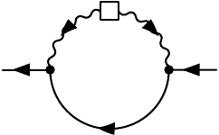
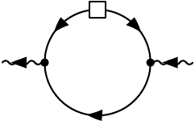
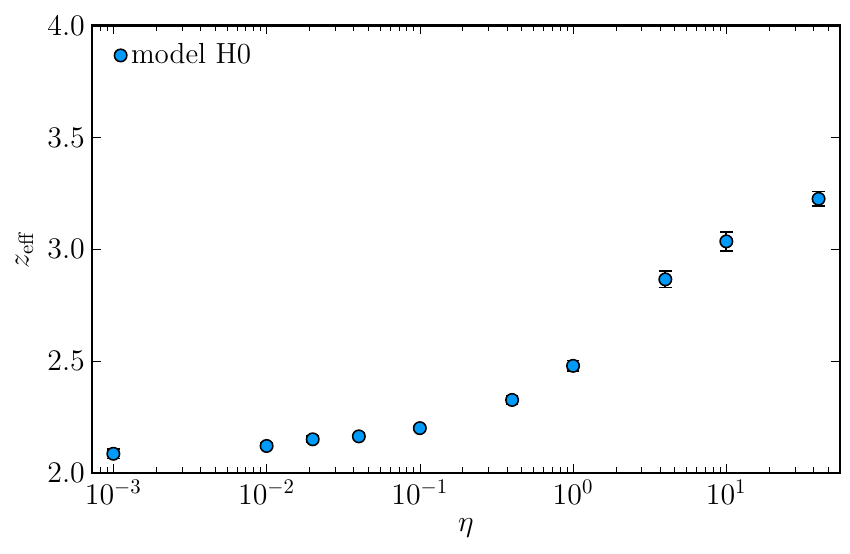
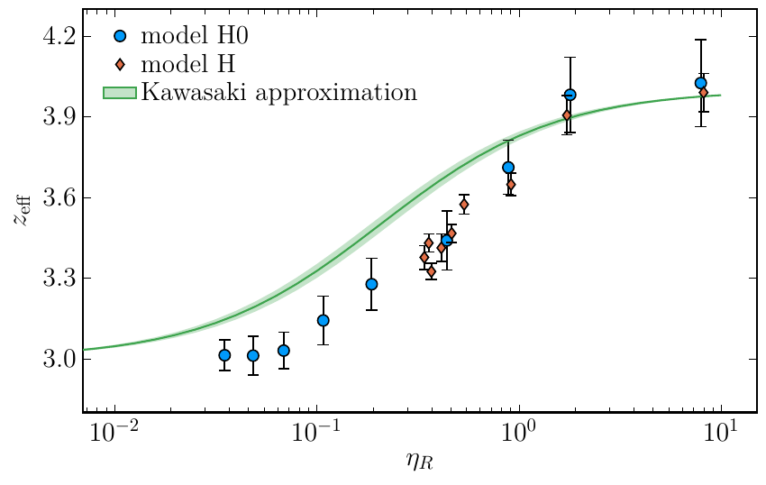

# Critical dynamics: model H <!-- .element: class="r-fit-text" -->

### Vladi Skokov

### North Carolina state University

- C. Chattopadhyay, J. Ott, T. Schaefer, V. S., 2403.10608 and 2411.15994

---

### Outline

- Introduction

  -
  -
  -

- Conclusions

---

###

$$
\partial_t\phi =   \Gamma \nabla^2 \left(\frac{\delta{\cal H}}{\delta \phi}\right) - \left(\nabla_i\phi\right) \frac{\delta{\cal H}}{\delta \pi_i^T} \zeta
$$

$$
\partial_t \pi^T_i = \eta \nabla^2 \left(\frac{\delta{\cal H}}{\delta \pi^T_i}\right) + P^T_{ij} \left[\left(\nabla_j\phi\right) \frac{\delta{\cal H}} {\delta\phi} \right] - P^T\_{ij} \left[ \nabla_k\left( \pi^{T}_j \frac{\delta{\cal H}}{\delta \pi^T_k}\right) \right] + \xi_i .
$$

$$
{\cal H}  = \int d^dx \left[ \frac{1}{2\rho} ( \pi_i^T)^2 +  \frac{1}{2} (\nabla \phi)^2 +  \frac{1}{2} m^2 \phi^2 +  \frac{1}{4} \lambda  \phi^4  + h \phi\right]
$$

$$
\langle \zeta (t, \vec{x}) \zeta (t', \vec{x}') \rangle = -2 T \Gamma \nabla^2 \delta(\vec{x}-\vec{x}')\delta(t-t')
$$

$$
\langle \xi_i (t, \vec{x}) \xi_j (t', \vec{x}') \rangle = -2 T \eta P^T_{ij} \nabla^2 \delta(\vec{x}-\vec{x}')\delta(t-t')
$$

---

---

---

---

---

---

---

---

---

---

---

---

---

---

---

---

---

---

###

---

### Conclusions

-
- -
  -
- ***

      - $$
